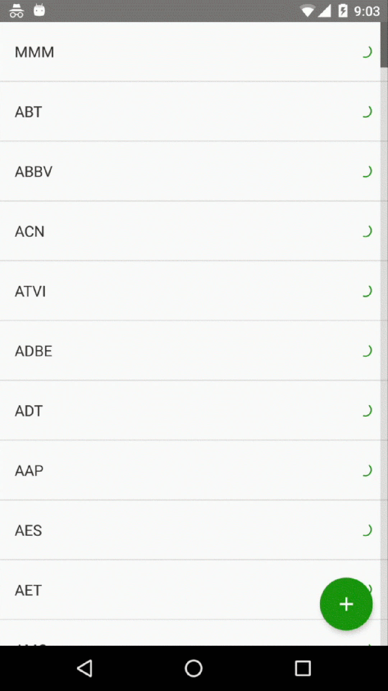
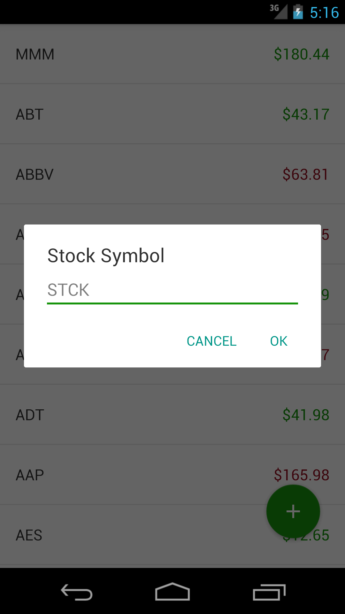
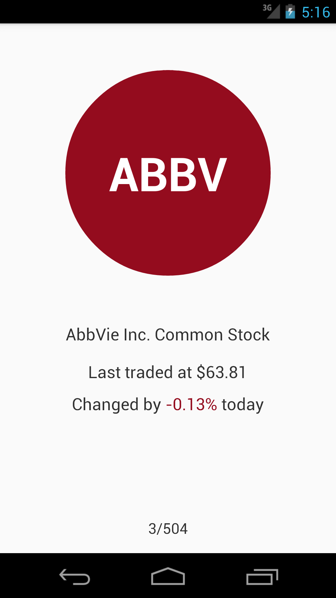
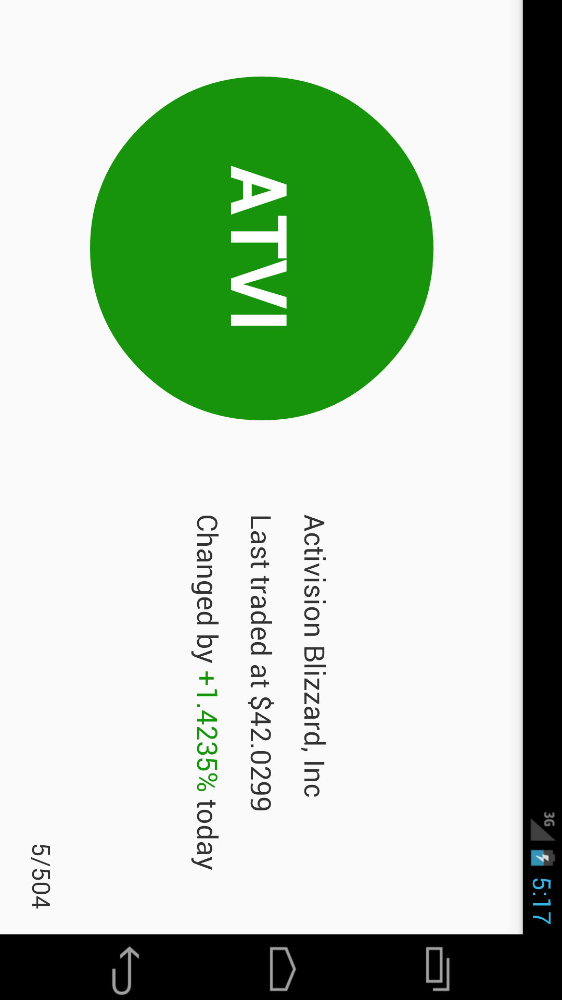

# `stock-watcher`

## Contents

0. [Screenshots](#1-screenshots)
0. [Overview](#2-overview)
0. [Features](#3-features)
  0. [Real-time stock quote updates](#i-real-time-stock-quote-updates)
  0. [Deduplicated last-in, first-out (LIFO) request buffering](#ii-deduplicated-last-in-first-out-lifo-request-buffering)
  0. [Read-through cache](#iii-read-through-cache)
0. [Setup](#4-setup)
  0. [Android Studio](#i-android-studio)
  0. [Command-line](#ii-command-line)
    0. [Build](#a-build)
    0. [Test](#b-test)
    0. [Install](#c-install)
0. [Environments](#5-environments)

## 1. Screenshots

[](screenshots/stock_list.gif)
[](screenshots/stock_add.png)
[](screenshots/stock_detail_portrait.png)
[](screenshots/stock_detail_landscape.png)

## 2. Overview

Demo Android stock watchlist app that demonstrates the following technologies:

  * [AutoFactory](//github.com/google/auto/tree/master/factory) (auto-generated factories for use with dependency injection)
  * [Butter Knife](http://jakewharton.github.io/butterknife/) (View and Listener binding)
  * [Dagger2](http://google.github.io/dagger/) (dependency injection)
  * [Data Binding](http://developer.android.com/topic/libraries/data-binding/index.html) (data binding to Views)
  * [Project Lombok](http://projectlombok.org/features/index.html) (boilerplate code generation)
  * [RxJava](//github.com/ReactiveX/RxJava/wiki)/[RxAndroid](//github.com/ReactiveX/RxAndroid/wiki) (reactive programming)
  * [Retrofit](http://square.github.io/retrofit/) (networking)
  * [Retrolambda](//github.com/evant/gradle-retrolambda) (Java8 lambdas and method references on Android)

## 3. Features

### i. Real-time stock quote updates

Updated every 2 seconds on both the [list](app-mvvm/src/main/java/cheneric/stockwatcher/viewmodel/StockQuoteListItemViewModel.java#L153) and [detail](app-mvvm/src/main/java/cheneric/stockwatcher/viewmodel/StockQuoteDetailViewModel.java#L133) screens if connected to wifi.

### ii. Deduplicated last-in, first-out (LIFO) request buffering

Stock quote requests are buffered in a [LinkedSet](app-mvvm/src/main/java/cheneric/stockwatcher/util/LinkedSet.java) that consolidates duplicate requests and executes the most recent requests first.

Furthermore, stock quote requests are batched into [groups of 20 quotes or 50ms](app-mvvm/src/main/java/cheneric/stockwatcher/model/StockQuoteService.java#L61), whichever comes first.

### iii. Read-through cache

Stock quotes are stored in an in-memory cache.  The ViewModel layer makes all requests to the [cache layer](app-mvvm/src/main/java/cheneric/stockwatcher/model/StockQuoteProvider.java#L32), which either services this request from memory if its cache entry [is fresh](app-mvvm/src/main/java/cheneric/stockwatcher/model/StockQuoteProvider.java#L70), or by [making a network request](app-mvvm/src/main/java/cheneric/stockwatcher/model/StockQuoteService.java#L42) if not.
  
## 4. Setup

### i. Android Studio

In Android Studio, go to:

```
Android Studio > Preferences > Plugins
```

Search for and install:

```
Lombok Plugin
```

This will allow Android Studio to generate code from Project Lombok annotations.

### ii. Command-line

#### a. Build

```
stock-watcher $ ./gradlew clean assembleDebug
```

#### b. Test

```
stock-watcher $ ./gradlew test
```

#### c. Install 

```
stock-watcher $ adb install -r app-mvvm/build/outputs/apk/app-mvvm-debug.apk
```

## 5. Environments

This project was built using the following development environment:

               | Environment         
-------------- | -------------------------
OS             | OS X El Capitain 10.11.16
Java           | 1.8.0_66-b17
Android Studio | 2.1.2

And tested on the following emulators and devices:

                  | Nexus 5 emulator | Nexus 5X
----------------- | ---------------- | -------------------
Android OS        | 4.1 (Jelly Bean) | 6.0.1 (Marshmallow)
Android API level | 16               | 23
Screen size       | 4.95"            | 5.2"
Screen resolution | 1080 x 1920      | 1080 x 1920
Screen density    | 445 ppi          | 423 ppi
