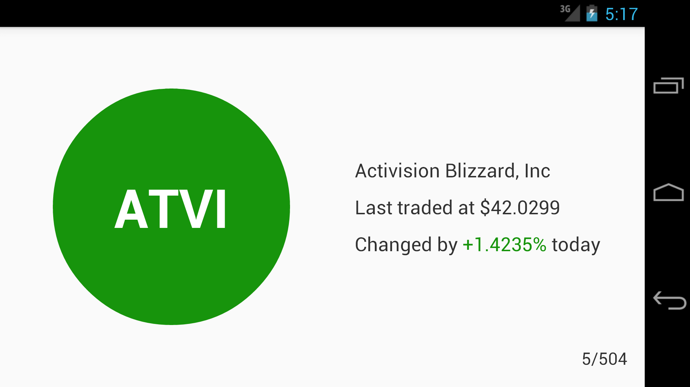

# `stock-watcher`

## Overview

Demo Android stock watchlist app that demonstrates the following technologies:

  * [Dagger2](http://google.github.io/dagger/) (dependency injection)
  * [Data Binding](https://developer.android.com/topic/libraries/data-binding/index.html)
  * [RxJava](https://github.com/ReactiveX/RxJava/wiki)/[RxAndroid](https://github.com/ReactiveX/RxAndroid/wiki)
  * [Retrofit](http://square.github.io/retrofit/) (networking)

## Features

### Realtime stock quote updates

Updated every 2 seconds on both the [list](https://github.com/cheneric/stock-watcher/blob/master/app-mvvm/src/main/java/cheneric/stockwatcher/viewmodel/StockQuoteListItemViewModel.java#L113) and [detail](https://github.com/cheneric/stock-watcher/blob/master/app-mvvm/src/main/java/cheneric/stockwatcher/viewmodel/StockQuoteDetailViewModel.java#L94) screens.

### Deduplicated last-in, first-out (LIFO) stock quote request buffering

Stock quote requests are buffered in a [LinkedSet](app-mvvm/src/main/java/cheneric/stockwatcher/util/LinkedSet.java) that consilidates duplicate requests and executes the most recent requests first.

Furthermore, stock quote requests are batched into [groups of 20 quotes or 50ms](app-mvvm/src/main/java/cheneric/stockwatcher/model/StockQuoteService.java#L58), whichever comes first.

### Read-through cache

Stock quotes are stored in an in-memory cache.  The ViewModel layer makes all requests to the [cache layer](app-mvvm/src/main/java/cheneric/stockwatcher/model/StockQuoteProvider.java#L32), which either services this request from memory if its cache entry [is fresh](app-mvvm/src/main/java/cheneric/stockwatcher/model/StockQuoteProvider.java#L70), or by [making a network request](app-mvvm/src/main/java/cheneric/stockwatcher/model/StockQuoteService.java#L39) if not.
  
## Screenshots

